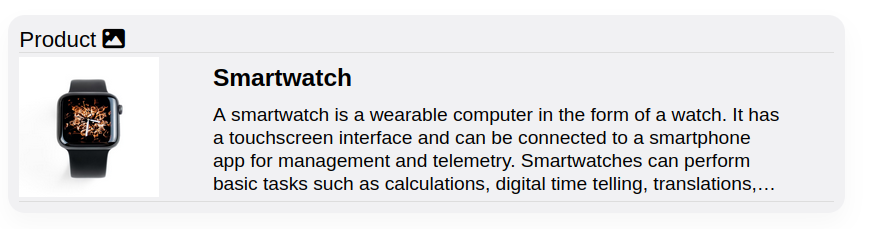

# JSONLD2HTHML-Cards
Render Schema.org JSON-LD into HTML with minimal dependencies by using Mustache templates.

```
                 ┌───────────────────────────────┐
                 │                               │
                 │   X     XXX    XXXX    X  X   │
                 │   X     X  XX      X   X  X   │
                 │   X     X   X     XX   XXXX   │
                 │   X     X  XX    XX    X  X   │
   JSON-LD       │   XXXX  XXX    XXXXX   X  X   │      HTML
---------------->│                               │--------------------->
                 │   +--------------+            │
                 │   |              |            │
                 │   |   Mustache   |            │
                 │   |              |            │+-------------------+
                 │   |   Templates  |            │|                   |
                 │   |              |            │|    Example CSS    |
                 │   +--------------+            │|                   |
                 │                               │+-------------------+
                 └───────────────────────────────┘
```

## 	Why?
**jsonld2html** is designed to be a compact, adaptable, and reusable solution, making it ideal for visualizing Schema.org data in HTML across various applications and platforms.

**Conversion Code Reusability:**

- Simple and painless visualization of data contained within JSON-LD. jsonld2html should provide everything you need to get you started and more.
- Seamless integration into JavaScript-enabled applications, especially webmailers.
- Several pre-built zero-dependency mustache templates supporting various Schema.org types.

**Themability:**

- Basic responsive design for consistent user experiences across devices.
- Example CSS file provided for bootstrapping. Just copy and paste it!
- Aims to be highly configurable to cover various use cases

**Language-agnostic Usage:**

- Easy to port to other languages due to mustache as the only dependency.
- Templates can also be used in non-JavaScript applications to ease rendering Schema.org data (thanks to mustache being available for multiple languages).

Use jsonld2html anywhere you would like to visualize Schema.org data, e.g. contained in structured E-Mails:

* Webmailers like [Roundcube](#Roundcube Plugin) or [Nextcloud Mail](#Nextcloud App)
* Mail clients providing a JavaScript API like Thunderbird
* ...

## Installation
⚠️ jsonld2html is currently in beta status.

You can get jsonld2html via [npm](http://npmjs.com).

```bash
$ npm install jsonld2html-cards --save
```

jsonld2html supports both web browsers and server-side environments:

* Most use cases will want to include it via `<script src="node_modules/jsonld2html-cards/jsonld2html-bundle.js"></script>` or Node.js's `require`.
* If you require an ECMAScript module, a separate file is provided via `<script type="module" src="node_modules/jsonld2html-cards/jsonld2html-bundle.mjs">`. It is automatically used for `import` statements.

## Usage
Below is a quick example how to use LD2H:

```js
import Jsonld2html from 'jsonld2html';

const ld_input = JSON.parse('{
  "@context": "https://schema.org",
  "@type": "Place",
  "geo": {
    "@type": "GeoCoordinates",
...
  "live" : true,
  "liveUri" : "https://www.sometest.eu/test/asd2345a"
}');

const html_output = Jsonld2html.render(ld_input);
```

This will return an HTML snippet surrounded by a `<div>` tag.

CSS need to be included separately. The `style/default_card.css` file should get you started.

Refer to [the style guide](docs/style_guide.md) for more details.

### Demo
(Will be available soon)

Try our demo at https://jsonld2html.github.io/demo/ to learn more.

## Templates
Templates are under the `templates/` folder.

`default_card.html` is the default template that has a simple card layout suitable for most schema.org types.



Other templates exist for certain types like FlightReservation and PromotionCards.


Current Limitations:

* Proper support for Base64-encoded inline images only. May not load external images.

For each template:

* There is an HTML file containing the mustache template.
* There is a JavaScript version of it (same filename but ending in .js)

`template_exporter.js` controls which templates can be used by the library:

### Excluding templates
In some scenarios, including all templates might be undesirable (e.g. using too many resources).

* Running `npm run build` will create a JavaScript file that bundles all available templates called `jsonld2html-bundle`.
* Removing lines at the beginning of the `template_exporter.js` file will exclude templates from said bundled file.

### Adding your own template
* Create a new HTML file for your new template and a file ending in `.js`
* Import the JavaScript file in `template_exporter.js`
* Make sure to fill both maps in `templates_exporter.js` as necessary

## Usage Examples
### Roundcube Plugin
Either install jsonld2html like mentioned above with `npm install --save` or copy and paste the `jsonld2html-bundle.js` manually into the repository.

JavaScript needs to be included in Roundcube plugins with the `include_script()` PHP function that is similar to calling `<script>`. So include the `jsonld2html-bundle.js` file via:

```php
$this->include_script("node_modules/jsonld2html-cards/jsonld2html-bundle.js");
```

*NOTE: At the time of writing, Roundcube still lacks support for transmitting JSON-LD to the JavaScript client. [roundcube/managesieve](https://github.com/roundcube/roundcubemail/tree/master/plugins/managesieve) plugin adds slight modifications to the Roundcube backend, so it passes structured e-mail data as an array of JSON-LDs to the JavaScript client code.*

Render each JSON-LD via `Jsonld2html.render(jsonObject)` in the JavaScript client code.

### Nextcloud App
As Nextcloud apps all typically use npm, install jsonld2html like mentioned above with `npm install --save`.

Nextcloud uses Vue.js, which uses `import` statements to pull in modules. So we include it via:

```javascript
import Jsonld2html from 'jsonld2html';
```

*NOTE: As of today, Nextcloud does not yet support transmitting JSON-LD to the JavaScript client by default. [This patched version of nextcloud-mail](https://github.com/audriga/nextcloud-mail) adds slight modifications to Nextcloud's backend, so it passes structured e-mail data as an array of JSON-LDs to the JavaScript client code via a JSON API.*

Render each JSON-LD via `Jsonld2html.render(jsonObject)` in the JavaScript client code.

## Testing
In order to run the tests, you'll need to install [Node.js](http://nodejs.org/).

Install dependencies.

```bash
$ npm install
```

Then run the tests.

```bash
$ npm test
```

To add a new test, do the following:

1. Insert your JSON-LD source file `<your-file-name>.json` in the `test/_files` folder.
2. Open `test/output/rendered_cards.html` and inspect manually
