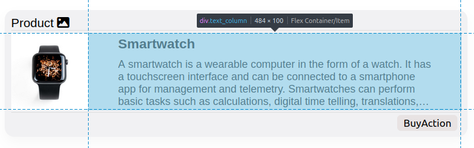

# JSONLD2HTHML-Cards Style Guide

JSONLD2HTML-Cards provides a CSS stylesheet with sane defaults suitable for common scenarios. It also aims to cover a large variety of use cases by providing a large degree of customization.

## Quickstart

The `style/default_card.css` file should give you everything you need to display JSON-LD with the default card layout as seen in the README of this project.

## Advanced Usage

The following section provides more details about the customizable CSS elements.

The layout is designed to be horizontally responsive and is built with rows and columns. No particular style is applied to the paragraphs so far.

#### smlCard

### Row structure of the card

#### header

The optional **breadcrumb** list will be rendered in this field.

#### smlCardRow

#### footer

Footer is an optional component only displayed for certain source data.

### Column structure of the card

#### image_column

##### img

#### text_column

### Row structure of the text_column

#### card_title

#### card_content

